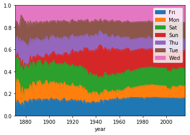
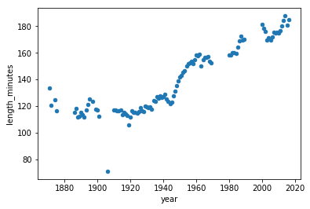

```python
import pandas as pd
import numpy as np
```


```python
gl = pd.read_csv(r'C:\Users\Administrator\Desktop\game_logs.csv')
gl.head()
```


<div>
<style>
    .dataframe thead tr:only-child th {
        text-align: right;
    }

    .dataframe thead th {
        text-align: left;
    }

    .dataframe tbody tr th {
        vertical-align: top;
    }
</style>
<table border="1" class="dataframe">
  <thead>
    <tr style="text-align: right;">
      <th></th>
      <th>date</th>
      <th>number_of_game</th>
      <th>day_of_week</th>
      <th>v_name</th>
      <th>v_league</th>
      <th>v_game_number</th>
      <th>h_name</th>
      <th>h_league</th>
      <th>h_game_number</th>
      <th>v_score</th>
      <th>...</th>
      <th>h_player_7_name</th>
      <th>h_player_7_def_pos</th>
      <th>h_player_8_id</th>
      <th>h_player_8_name</th>
      <th>h_player_8_def_pos</th>
      <th>h_player_9_id</th>
      <th>h_player_9_name</th>
      <th>h_player_9_def_pos</th>
      <th>additional_info</th>
      <th>acquisition_info</th>
    </tr>
  </thead>
  <tbody>
    <tr>
      <th>0</th>
      <td>18710504</td>
      <td>0</td>
      <td>Thu</td>
      <td>CL1</td>
      <td>na</td>
      <td>1</td>
      <td>FW1</td>
      <td>na</td>
      <td>1</td>
      <td>0</td>
      <td>...</td>
      <td>Ed Mincher</td>
      <td>7.0</td>
      <td>mcdej101</td>
      <td>James McDermott</td>
      <td>8.0</td>
      <td>kellb105</td>
      <td>Bill Kelly</td>
      <td>9.0</td>
      <td>NaN</td>
      <td>Y</td>
    </tr>
    <tr>
      <th>1</th>
      <td>18710505</td>
      <td>0</td>
      <td>Fri</td>
      <td>BS1</td>
      <td>na</td>
      <td>1</td>
      <td>WS3</td>
      <td>na</td>
      <td>1</td>
      <td>20</td>
      <td>...</td>
      <td>Asa Brainard</td>
      <td>1.0</td>
      <td>burrh101</td>
      <td>Henry Burroughs</td>
      <td>9.0</td>
      <td>berth101</td>
      <td>Henry Berthrong</td>
      <td>8.0</td>
      <td>HTBF</td>
      <td>Y</td>
    </tr>
    <tr>
      <th>2</th>
      <td>18710506</td>
      <td>0</td>
      <td>Sat</td>
      <td>CL1</td>
      <td>na</td>
      <td>2</td>
      <td>RC1</td>
      <td>na</td>
      <td>1</td>
      <td>12</td>
      <td>...</td>
      <td>Pony Sager</td>
      <td>6.0</td>
      <td>birdg101</td>
      <td>George Bird</td>
      <td>7.0</td>
      <td>stirg101</td>
      <td>Gat Stires</td>
      <td>9.0</td>
      <td>NaN</td>
      <td>Y</td>
    </tr>
    <tr>
      <th>3</th>
      <td>18710508</td>
      <td>0</td>
      <td>Mon</td>
      <td>CL1</td>
      <td>na</td>
      <td>3</td>
      <td>CH1</td>
      <td>na</td>
      <td>1</td>
      <td>12</td>
      <td>...</td>
      <td>Ed Duffy</td>
      <td>6.0</td>
      <td>pinke101</td>
      <td>Ed Pinkham</td>
      <td>5.0</td>
      <td>zettg101</td>
      <td>George Zettlein</td>
      <td>1.0</td>
      <td>NaN</td>
      <td>Y</td>
    </tr>
    <tr>
      <th>4</th>
      <td>18710509</td>
      <td>0</td>
      <td>Tue</td>
      <td>BS1</td>
      <td>na</td>
      <td>2</td>
      <td>TRO</td>
      <td>na</td>
      <td>1</td>
      <td>9</td>
      <td>...</td>
      <td>Steve Bellan</td>
      <td>5.0</td>
      <td>pikel101</td>
      <td>Lip Pike</td>
      <td>3.0</td>
      <td>cravb101</td>
      <td>Bill Craver</td>
      <td>6.0</td>
      <td>HTBF</td>
      <td>Y</td>
    </tr>
  </tbody>
</table>
<p>5 rows × 161 columns</p>
</div>


```python
gl.info(memory_usage='deep')
```

    <class 'pandas.core.frame.DataFrame'>
    RangeIndex: 171907 entries, 0 to 171906
    Columns: 161 entries, date to acquisition_info
    dtypes: float64(77), int64(6), object(78)
    memory usage: 503.7 MB
    


```python
for dtype in ['float','int64','object']:
    selected_dtype = gl.select_dtypes(include=[dtype])
    mean_usage_b = selected_dtype.memory_usage().mean()
    mean_usage_mb = mean_usage_b / 1024 ** 2
    print("Average memory usage for {} columns: {:03.2f} MB".format(dtype,mean_usage_mb))
```

    Average memory usage for float columns: 1.29 MB
    Average memory usage for int64 columns: 1.12 MB
    Average memory usage for object columns: 0.65 MB
    


```python
int_types = ["uint8", "int8", "int16"]
for it in int_types:
    print(np.iinfo(it))
```

    Machine parameters for uint8
    ---------------------------------------------------------------
    min = 0
    max = 255
    ---------------------------------------------------------------
    
    Machine parameters for int8
    ---------------------------------------------------------------
    min = -128
    max = 127
    ---------------------------------------------------------------
    
    Machine parameters for int16
    ---------------------------------------------------------------
    min = -32768
    max = 32767
    ---------------------------------------------------------------
    
    


```python
def mem_usage(pandas_obj):
    if isinstance(pandas_obj,pd.DataFrame):
        usage_b = pandas_obj.memory_usage(deep=True).sum()
    else: # we assume if not a df it's a series
        usage_b = pandas_obj.memory_usage(deep=True)
    usage_mb = usage_b / 1024 ** 2 # convert bytes to megabytes
    return "{:03.2f} MB".format(usage_mb)

gl_int = gl.select_dtypes(include=['int64'])
converted_int = gl_int.apply(pd.to_numeric,downcast='unsigned')

print(mem_usage(gl_int))
print(mem_usage(converted_int))

compare_ints = pd.concat([gl_int.dtypes,converted_int.dtypes],axis=1)

compare_ints.columns = ['before','after']
compare_ints.apply(pd.Series.value_counts)
```

    7.00 MB
    1.00 MB
    


<div>
<style>
    .dataframe thead tr:only-child th {
        text-align: right;
    }

    .dataframe thead th {
        text-align: left;
    }

    .dataframe tbody tr th {
        vertical-align: top;
    }
</style>
<table border="1" class="dataframe">
  <thead>
    <tr style="text-align: right;">
      <th></th>
      <th>before</th>
      <th>after</th>
    </tr>
  </thead>
  <tbody>
    <tr>
      <th>uint8</th>
      <td>NaN</td>
      <td>5.0</td>
    </tr>
    <tr>
      <th>uint32</th>
      <td>NaN</td>
      <td>1.0</td>
    </tr>
    <tr>
      <th>int64</th>
      <td>6.0</td>
      <td>NaN</td>
    </tr>
  </tbody>
</table>
</div>


```python
gl_float = gl.select_dtypes(include=['float'])
converted_float = gl_float.apply(pd.to_numeric,downcast='float')

print(mem_usage(gl_float))
print(mem_usage(converted_float))

compare_floats = pd.concat([gl_float.dtypes,converted_float.dtypes],axis=1)
compare_floats.columns = ['before','after']
compare_floats.apply(pd.Series.value_counts)
```

    100.00 MB
    50.00 MB
    


<div>
<style>
    .dataframe thead tr:only-child th {
        text-align: right;
    }

    .dataframe thead th {
        text-align: left;
    }

    .dataframe tbody tr th {
        vertical-align: top;
    }
</style>
<table border="1" class="dataframe">
  <thead>
    <tr style="text-align: right;">
      <th></th>
      <th>before</th>
      <th>after</th>
    </tr>
  </thead>
  <tbody>
    <tr>
      <th>float32</th>
      <td>NaN</td>
      <td>77.0</td>
    </tr>
    <tr>
      <th>float64</th>
      <td>77.0</td>
      <td>NaN</td>
    </tr>
  </tbody>
</table>
</div>


```python
optimized_gl = gl.copy()

optimized_gl[converted_int.columns] = converted_int
optimized_gl[converted_float.columns] = converted_float

print(mem_usage(gl))
print(mem_usage(optimized_gl))
```

    503.00 MB
    453.00 MB
    


```python
gl_obj = gl.select_dtypes(include=['object']).copy()
gl_obj.describe()
```


<div>
<style>
    .dataframe thead tr:only-child th {
        text-align: right;
    }

    .dataframe thead th {
        text-align: left;
    }

    .dataframe tbody tr th {
        vertical-align: top;
    }
</style>
<table border="1" class="dataframe">
  <thead>
    <tr style="text-align: right;">
      <th></th>
      <th>day_of_week</th>
      <th>v_name</th>
      <th>v_league</th>
      <th>h_name</th>
      <th>h_league</th>
      <th>day_night</th>
      <th>completion</th>
      <th>forefeit</th>
      <th>protest</th>
      <th>park_id</th>
      <th>...</th>
      <th>h_player_6_id</th>
      <th>h_player_6_name</th>
      <th>h_player_7_id</th>
      <th>h_player_7_name</th>
      <th>h_player_8_id</th>
      <th>h_player_8_name</th>
      <th>h_player_9_id</th>
      <th>h_player_9_name</th>
      <th>additional_info</th>
      <th>acquisition_info</th>
    </tr>
  </thead>
  <tbody>
    <tr>
      <th>count</th>
      <td>171907</td>
      <td>171907</td>
      <td>171907</td>
      <td>171907</td>
      <td>171907</td>
      <td>140150</td>
      <td>116</td>
      <td>145</td>
      <td>180</td>
      <td>171907</td>
      <td>...</td>
      <td>140838</td>
      <td>140838</td>
      <td>140838</td>
      <td>140838</td>
      <td>140838</td>
      <td>140838</td>
      <td>140838</td>
      <td>140838</td>
      <td>1456</td>
      <td>140841</td>
    </tr>
    <tr>
      <th>unique</th>
      <td>7</td>
      <td>148</td>
      <td>7</td>
      <td>148</td>
      <td>7</td>
      <td>2</td>
      <td>116</td>
      <td>3</td>
      <td>5</td>
      <td>245</td>
      <td>...</td>
      <td>4774</td>
      <td>4720</td>
      <td>5253</td>
      <td>5197</td>
      <td>4760</td>
      <td>4710</td>
      <td>5193</td>
      <td>5142</td>
      <td>332</td>
      <td>1</td>
    </tr>
    <tr>
      <th>top</th>
      <td>Sat</td>
      <td>CHN</td>
      <td>NL</td>
      <td>CHN</td>
      <td>NL</td>
      <td>D</td>
      <td>19820711,CHI11,5,5,54</td>
      <td>H</td>
      <td>V</td>
      <td>STL07</td>
      <td>...</td>
      <td>grimc101</td>
      <td>Charlie Grimm</td>
      <td>grimc101</td>
      <td>Charlie Grimm</td>
      <td>lopea102</td>
      <td>Al Lopez</td>
      <td>spahw101</td>
      <td>Warren Spahn</td>
      <td>HTBF</td>
      <td>Y</td>
    </tr>
    <tr>
      <th>freq</th>
      <td>28891</td>
      <td>8870</td>
      <td>88866</td>
      <td>9024</td>
      <td>88867</td>
      <td>82724</td>
      <td>1</td>
      <td>69</td>
      <td>90</td>
      <td>7022</td>
      <td>...</td>
      <td>427</td>
      <td>427</td>
      <td>491</td>
      <td>491</td>
      <td>676</td>
      <td>676</td>
      <td>339</td>
      <td>339</td>
      <td>1112</td>
      <td>140841</td>
    </tr>
  </tbody>
</table>
<p>4 rows × 78 columns</p>
</div>


```python
dow = gl_obj.day_of_week
print(dow.head())

dow_cat = dow.astype('category')
print(dow_cat.head())
```

    0    Thu
    1    Fri
    2    Sat
    3    Mon
    4    Tue
    Name: day_of_week, dtype: object
    0    Thu
    1    Fri
    2    Sat
    3    Mon
    4    Tue
    Name: day_of_week, dtype: category
    Categories (7, object): [Fri, Mon, Sat, Sun, Thu, Tue, Wed]
    


```python
dow_cat.head().cat.codes
```


    0    4
    1    0
    2    2
    3    1
    4    5
    dtype: int8


```python
print(mem_usage(dow))
print(mem_usage(dow_cat))
```

    0.00 MB
    0.00 MB
    


```python
converted_obj = pd.DataFrame()

for col in gl_obj.columns:
    num_unique_values = len(gl_obj[col].unique())
    num_total_values = len(gl_obj[col])
    if num_unique_values / num_total_values < 0.5:
        converted_obj.loc[:,col] = gl_obj[col].astype('category')
    else:
        converted_obj.loc[:,col] = gl_obj[col]
```


```python
print(mem_usage(gl_obj))
print(mem_usage(converted_obj))

# compare_obj = pd.concat([gl_obj.dtypes,converted_obj.dtypes],axis=1)
# compare_obj.columns = ['before','after']
# compare_obj.apply(pd.Series.value_counts)
```

    394.00 MB
    39.00 MB
    


```python
optimized_gl[converted_obj.columns] = converted_obj

mem_usage(optimized_gl)
```


    '97.00 MB'


```python
date = optimized_gl.date
print(mem_usage(date))
date.head()
```

    1.00 MB
    


    0    18710504
    1    18710505
    2    18710506
    3    18710508
    4    18710509
    Name: date, dtype: int64


```python
dtypes = optimized_gl.drop('date',axis=1).dtypes

dtypes_col = dtypes.index
dtypes_type = [i.name for i in dtypes.values]

column_types = dict(zip(dtypes_col, dtypes_type))

# rather than print all 161 items, we'll
# sample 10 key/value pairs from the dict
# and print it nicely using prettyprint

preview = first2pairs = {key:value for key,value in list(column_types.items())[:10]}
import pprint
pp = pp = pprint.PrettyPrinter(indent=4)
pp.pprint(preview) 
```

    {   '3b_umpire_name': 'category',
        'h_name': 'category',
        'h_rbi': 'float32',
        'hp_umpire_name': 'category',
        'protest': 'category',
        'v_caught_stealing': 'float32',
        'v_hits': 'float32',
        'v_left_on_base': 'float32',
        'v_manager_id': 'category',
        'v_strikeouts': 'float32'}
    


```python
optimized_gl['date'] = pd.to_datetime(date,format='%Y%m%d')

print(mem_usage(optimized_gl))
optimized_gl.date.head()
```

    97.00 MB
    


    0   1871-05-04 00:00:00
    1   1871-05-05 00:00:00
    2   1871-05-06 00:00:00
    3   1871-05-08 00:00:00
    4   1871-05-09 00:00:00
    Name: date, dtype: datetime64[ns]


```python
read_and_optimized = pd.read_csv(r'C:\Users\Administrator\Desktop\game_logs.csv',dtype=column_types,parse_dates=['date'],infer_datetime_format=True)

print(mem_usage(read_and_optimized))
read_and_optimized.head() 
```

    97.00 MB
    


<div>
<style>
    .dataframe thead tr:only-child th {
        text-align: right;
    }

    .dataframe thead th {
        text-align: left;
    }

    .dataframe tbody tr th {
        vertical-align: top;
    }
</style>
<table border="1" class="dataframe">
  <thead>
    <tr style="text-align: right;">
      <th></th>
      <th>date</th>
      <th>number_of_game</th>
      <th>day_of_week</th>
      <th>v_name</th>
      <th>v_league</th>
      <th>v_game_number</th>
      <th>h_name</th>
      <th>h_league</th>
      <th>h_game_number</th>
      <th>v_score</th>
      <th>...</th>
      <th>h_player_7_name</th>
      <th>h_player_7_def_pos</th>
      <th>h_player_8_id</th>
      <th>h_player_8_name</th>
      <th>h_player_8_def_pos</th>
      <th>h_player_9_id</th>
      <th>h_player_9_name</th>
      <th>h_player_9_def_pos</th>
      <th>additional_info</th>
      <th>acquisition_info</th>
    </tr>
  </thead>
  <tbody>
    <tr>
      <th>0</th>
      <td>1871-05-04 00:00:00</td>
      <td>0</td>
      <td>Thu</td>
      <td>CL1</td>
      <td>na</td>
      <td>1</td>
      <td>FW1</td>
      <td>na</td>
      <td>1</td>
      <td>0</td>
      <td>...</td>
      <td>Ed Mincher</td>
      <td>7.0</td>
      <td>mcdej101</td>
      <td>James McDermott</td>
      <td>8.0</td>
      <td>kellb105</td>
      <td>Bill Kelly</td>
      <td>9.0</td>
      <td>NaN</td>
      <td>Y</td>
    </tr>
    <tr>
      <th>1</th>
      <td>1871-05-05 00:00:00</td>
      <td>0</td>
      <td>Fri</td>
      <td>BS1</td>
      <td>na</td>
      <td>1</td>
      <td>WS3</td>
      <td>na</td>
      <td>1</td>
      <td>20</td>
      <td>...</td>
      <td>Asa Brainard</td>
      <td>1.0</td>
      <td>burrh101</td>
      <td>Henry Burroughs</td>
      <td>9.0</td>
      <td>berth101</td>
      <td>Henry Berthrong</td>
      <td>8.0</td>
      <td>HTBF</td>
      <td>Y</td>
    </tr>
    <tr>
      <th>2</th>
      <td>1871-05-06 00:00:00</td>
      <td>0</td>
      <td>Sat</td>
      <td>CL1</td>
      <td>na</td>
      <td>2</td>
      <td>RC1</td>
      <td>na</td>
      <td>1</td>
      <td>12</td>
      <td>...</td>
      <td>Pony Sager</td>
      <td>6.0</td>
      <td>birdg101</td>
      <td>George Bird</td>
      <td>7.0</td>
      <td>stirg101</td>
      <td>Gat Stires</td>
      <td>9.0</td>
      <td>NaN</td>
      <td>Y</td>
    </tr>
    <tr>
      <th>3</th>
      <td>1871-05-08 00:00:00</td>
      <td>0</td>
      <td>Mon</td>
      <td>CL1</td>
      <td>na</td>
      <td>3</td>
      <td>CH1</td>
      <td>na</td>
      <td>1</td>
      <td>12</td>
      <td>...</td>
      <td>Ed Duffy</td>
      <td>6.0</td>
      <td>pinke101</td>
      <td>Ed Pinkham</td>
      <td>5.0</td>
      <td>zettg101</td>
      <td>George Zettlein</td>
      <td>1.0</td>
      <td>NaN</td>
      <td>Y</td>
    </tr>
    <tr>
      <th>4</th>
      <td>1871-05-09 00:00:00</td>
      <td>0</td>
      <td>Tue</td>
      <td>BS1</td>
      <td>na</td>
      <td>2</td>
      <td>TRO</td>
      <td>na</td>
      <td>1</td>
      <td>9</td>
      <td>...</td>
      <td>Steve Bellan</td>
      <td>5.0</td>
      <td>pikel101</td>
      <td>Lip Pike</td>
      <td>3.0</td>
      <td>cravb101</td>
      <td>Bill Craver</td>
      <td>6.0</td>
      <td>HTBF</td>
      <td>Y</td>
    </tr>
  </tbody>
</table>
<p>5 rows × 161 columns</p>
</div>


```python
import matplotlib.pyplot as plt
```


```python
optimized_gl['year'] = optimized_gl.date.dt.year
games_per_day = optimized_gl.pivot_table(index='year',columns='day_of_week',values='date',aggfunc=len)
games_per_day = games_per_day.divide(games_per_day.sum(axis=1),axis=0)

ax = games_per_day.plot(kind='area',stacked='true')
ax.legend(loc='upper right')
ax.set_ylim(0,1)
plt.show() 
# optimized_gl.head()
```





```python
game_lengths = optimized_gl.pivot_table(index='year', values='length_minutes')
game_lengths.reset_index().plot.scatter('year','length_minutes')
plt.show() 
```




