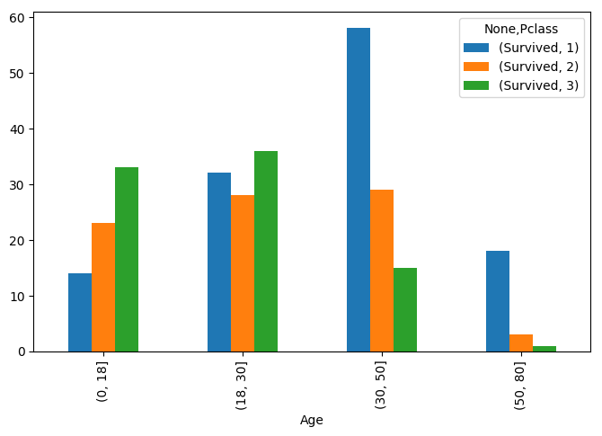
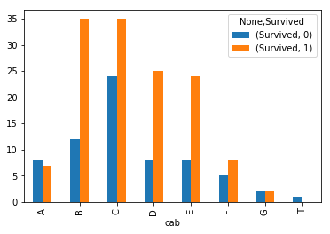
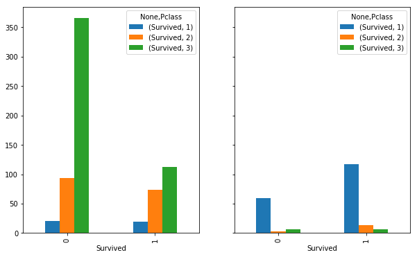
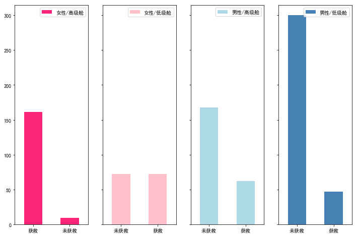
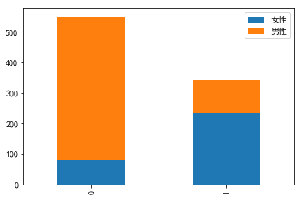
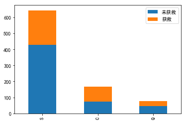
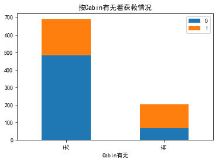
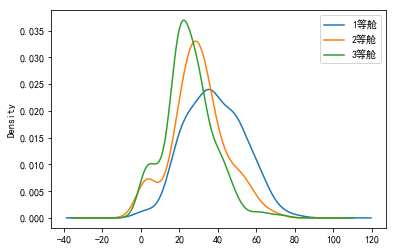
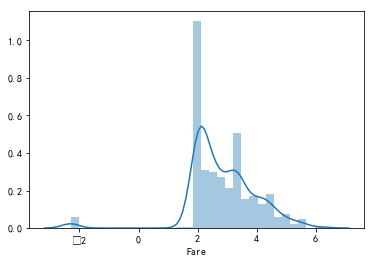

```python
%pylab inline
import pandas as pd #数据分析
import numpy as np #科学计算
import matplotlib.pyplot as plt
import matplotlib
from pandas import Series,DataFrame
```

    Populating the interactive namespace from numpy and matplotlib
    


```python
data_train = pd.read_csv('train.csv')
data_train.head()
# list(data_train.index[data_train['Cabin'].isnull()])
```


<div>
<style>
    .dataframe thead tr:only-child th {
        text-align: right;
    }

    .dataframe thead th {
        text-align: left;
    }

    .dataframe tbody tr th {
        vertical-align: top;
    }
</style>
<table border="1" class="dataframe">
  <thead>
    <tr style="text-align: right;">
      <th></th>
      <th>PassengerId</th>
      <th>Survived</th>
      <th>Pclass</th>
      <th>Name</th>
      <th>Sex</th>
      <th>Age</th>
      <th>SibSp</th>
      <th>Parch</th>
      <th>Ticket</th>
      <th>Fare</th>
      <th>Cabin</th>
      <th>Embarked</th>
    </tr>
  </thead>
  <tbody>
    <tr>
      <th>0</th>
      <td>1</td>
      <td>0</td>
      <td>3</td>
      <td>Braund, Mr. Owen Harris</td>
      <td>male</td>
      <td>22.0</td>
      <td>1</td>
      <td>0</td>
      <td>A/5 21171</td>
      <td>7.2500</td>
      <td>NaN</td>
      <td>S</td>
    </tr>
    <tr>
      <th>1</th>
      <td>2</td>
      <td>1</td>
      <td>1</td>
      <td>Cumings, Mrs. John Bradley (Florence Briggs Th...</td>
      <td>female</td>
      <td>38.0</td>
      <td>1</td>
      <td>0</td>
      <td>PC 17599</td>
      <td>71.2833</td>
      <td>C85</td>
      <td>C</td>
    </tr>
    <tr>
      <th>2</th>
      <td>3</td>
      <td>1</td>
      <td>3</td>
      <td>Heikkinen, Miss. Laina</td>
      <td>female</td>
      <td>26.0</td>
      <td>0</td>
      <td>0</td>
      <td>STON/O2. 3101282</td>
      <td>7.9250</td>
      <td>NaN</td>
      <td>S</td>
    </tr>
    <tr>
      <th>3</th>
      <td>4</td>
      <td>1</td>
      <td>1</td>
      <td>Futrelle, Mrs. Jacques Heath (Lily May Peel)</td>
      <td>female</td>
      <td>35.0</td>
      <td>1</td>
      <td>0</td>
      <td>113803</td>
      <td>53.1000</td>
      <td>C123</td>
      <td>S</td>
    </tr>
    <tr>
      <th>4</th>
      <td>5</td>
      <td>0</td>
      <td>3</td>
      <td>Allen, Mr. William Henry</td>
      <td>male</td>
      <td>35.0</td>
      <td>0</td>
      <td>0</td>
      <td>373450</td>
      <td>8.0500</td>
      <td>NaN</td>
      <td>S</td>
    </tr>
  </tbody>
</table>
</div>


```python
data_train.info()
```

    <class 'pandas.core.frame.DataFrame'>
    RangeIndex: 891 entries, 0 to 890
    Data columns (total 12 columns):
    PassengerId    891 non-null int64
    Survived       891 non-null int64
    Pclass         891 non-null int64
    Name           891 non-null object
    Sex            891 non-null object
    Age            714 non-null float64
    SibSp          891 non-null int64
    Parch          891 non-null int64
    Ticket         891 non-null object
    Fare           891 non-null float64
    Cabin          204 non-null object
    Embarked       889 non-null object
    dtypes: float64(2), int64(5), object(5)
    memory usage: 83.6+ KB
    


```python
data_train.describe()
```


<div>
<style>
    .dataframe thead tr:only-child th {
        text-align: right;
    }

    .dataframe thead th {
        text-align: left;
    }

    .dataframe tbody tr th {
        vertical-align: top;
    }
</style>
<table border="1" class="dataframe">
  <thead>
    <tr style="text-align: right;">
      <th></th>
      <th>PassengerId</th>
      <th>Survived</th>
      <th>Pclass</th>
      <th>Age</th>
      <th>SibSp</th>
      <th>Parch</th>
      <th>Fare</th>
    </tr>
  </thead>
  <tbody>
    <tr>
      <th>count</th>
      <td>891.000000</td>
      <td>891.000000</td>
      <td>891.000000</td>
      <td>714.000000</td>
      <td>891.000000</td>
      <td>891.000000</td>
      <td>891.000000</td>
    </tr>
    <tr>
      <th>mean</th>
      <td>446.000000</td>
      <td>0.383838</td>
      <td>2.308642</td>
      <td>29.699118</td>
      <td>0.523008</td>
      <td>0.381594</td>
      <td>32.204208</td>
    </tr>
    <tr>
      <th>std</th>
      <td>257.353842</td>
      <td>0.486592</td>
      <td>0.836071</td>
      <td>14.526497</td>
      <td>1.102743</td>
      <td>0.806057</td>
      <td>49.693429</td>
    </tr>
    <tr>
      <th>min</th>
      <td>1.000000</td>
      <td>0.000000</td>
      <td>1.000000</td>
      <td>0.420000</td>
      <td>0.000000</td>
      <td>0.000000</td>
      <td>0.000000</td>
    </tr>
    <tr>
      <th>25%</th>
      <td>223.500000</td>
      <td>0.000000</td>
      <td>2.000000</td>
      <td>20.125000</td>
      <td>0.000000</td>
      <td>0.000000</td>
      <td>7.910400</td>
    </tr>
    <tr>
      <th>50%</th>
      <td>446.000000</td>
      <td>0.000000</td>
      <td>3.000000</td>
      <td>28.000000</td>
      <td>0.000000</td>
      <td>0.000000</td>
      <td>14.454200</td>
    </tr>
    <tr>
      <th>75%</th>
      <td>668.500000</td>
      <td>1.000000</td>
      <td>3.000000</td>
      <td>38.000000</td>
      <td>1.000000</td>
      <td>0.000000</td>
      <td>31.000000</td>
    </tr>
    <tr>
      <th>max</th>
      <td>891.000000</td>
      <td>1.000000</td>
      <td>3.000000</td>
      <td>80.000000</td>
      <td>8.000000</td>
      <td>6.000000</td>
      <td>512.329200</td>
    </tr>
  </tbody>
</table>
</div>


```python
fig, ax = plt.subplots(figsize=(8,5),dpi=100)
age = pd.cut(data_train.Age,[0,18,30,50,80])
data_train.pivot_table(index=age,columns='Pclass',aggfunc={'Survived':sum}).plot(ax=ax,kind='bar',fontsize=10)
plt.xlabel('Age', fontsize=10)
```


    <matplotlib.text.Text at 0x1de33c587f0>





```python
import re
# 房间号有隐藏信息
cabin_data = data_train.loc[data_train['Cabin'].notnull()]
cabin_na = data_train.loc[data_train['Cabin'].isnull()]
# 房间号不为空值的数据，用开头的字母表示一个新的分类
# 注意用np.nan充填NaN值
def alpha_cabin(x):
    ind = list(x.index[x.isnull()])
    res = []
    for i in range(x.shape[0]):
        if i in ind:
            res.append(np.nan)
        else:
            m = re.findall(r'[A-Z]',x.iloc[i])
            if m:
                res.append(m[0])
            else:
                res.append(np.nan)
    return pd.DataFrame({'cab':res},index=x.index)
cabin_data = pd.concat([cabin_data, alpha_cabin(cabin_data['Cabin'])],axis=1)
cabin_data.head()

cabin_data.pivot_table(index='cab',columns='Survived',aggfunc={'Survived':len}).plot(kind='bar')
# from collections import Counter
# Counter(cabin_data['Pclass'])
# Counter(cabin_na['Pclass'])
```


    <matplotlib.axes._subplots.AxesSubplot at 0x203c40ac240>





```python
fig, ax = plt.subplots(1,2,sharey=True,figsize=(10,6))
cabin_na.pivot_table(index='Survived',columns='Pclass',aggfunc={'Survived':len}).plot(ax=ax[0],kind='bar')
cabin_data.pivot_table(index='Survived',columns='Pclass',aggfunc={'Survived':len}).plot(ax=ax[1],kind='bar')
```


    <matplotlib.axes._subplots.AxesSubplot at 0x21b2e55e748>





```python
data_train.pivot_table(index='Sex', columns='Pclass',
aggfunc={'Survived':sum, 'Fare':'mean'})
```


<div>
<style>
    .dataframe thead tr:only-child th {
        text-align: right;
    }

    .dataframe thead th {
        text-align: left;
    }

    .dataframe tbody tr th {
        vertical-align: top;
    }
</style>
<table border="1" class="dataframe">
  <thead>
    <tr>
      <th></th>
      <th colspan="3" halign="left">Fare</th>
      <th colspan="3" halign="left">Survived</th>
    </tr>
    <tr>
      <th>Pclass</th>
      <th>1</th>
      <th>2</th>
      <th>3</th>
      <th>1</th>
      <th>2</th>
      <th>3</th>
    </tr>
    <tr>
      <th>Sex</th>
      <th></th>
      <th></th>
      <th></th>
      <th></th>
      <th></th>
      <th></th>
    </tr>
  </thead>
  <tbody>
    <tr>
      <th>female</th>
      <td>106.125798</td>
      <td>21.970121</td>
      <td>16.118810</td>
      <td>91</td>
      <td>70</td>
      <td>72</td>
    </tr>
    <tr>
      <th>male</th>
      <td>67.226127</td>
      <td>19.741782</td>
      <td>12.661633</td>
      <td>45</td>
      <td>17</td>
      <td>47</td>
    </tr>
  </tbody>
</table>
</div>


```python
mpl.rcParams['font.sans-serif'] = ['SimHei']
# matplotlib.font_manager.FontProperties(fname='simhei.ttf')
fig, ax = plt.subplots(1,4,sharey=True,figsize=(12,8))

data_train.Survived[data_train.Sex == 'female'][data_train.Pclass != 3].value_counts().plot(ax=ax[0],kind='bar', label="female highclass", color='#FA2479')
ax[0].set_xticklabels(["获救", "未获救"], rotation=0)
ax[0].legend(["女性/高级舱"], loc='best')

data_train.Survived[data_train.Sex == 'female'][data_train.Pclass == 3].value_counts().plot(ax=ax[1],kind='bar', label='female, low class', color='pink')
ax[1].set_xticklabels(["未获救", "获救"], rotation=0)
ax[1].legend(["女性/低级舱"], loc='best')


data_train.Survived[data_train.Sex == 'male'][data_train.Pclass != 3].value_counts().plot(ax=ax[2],kind='bar', label='male, high class',color='lightblue')
ax[2].set_xticklabels(["未获救", "获救"], rotation=0)
ax[2].legend(["男性/高级舱"], loc='best')


data_train.Survived[data_train.Sex == 'male'][data_train.Pclass == 3].value_counts().plot(ax=ax[3],kind='bar', label='male low class', color='steelblue')
ax[3].set_xticklabels(["未获救", "获救"], rotation=0)
ax[3].legend(["男性/低级舱"], loc='best')

```


    <matplotlib.legend.Legend at 0x1de4315d0b8>





```python
Survived_m = data_train.Survived[data_train.Sex == 'male'].value_counts()
Survived_f = data_train.Survived[data_train.Sex == 'female'].value_counts()
df=pd.DataFrame({u'男性':Survived_m, u'女性':Survived_f})
df.plot(kind='bar', stacked=True)
```


    <matplotlib.axes._subplots.AxesSubplot at 0x16618a8e9b0>





```python
Survived_0 = data_train.Embarked[data_train.Survived == 0].value_counts()
Survived_1 = data_train.Embarked[data_train.Survived == 1].value_counts()
df=pd.DataFrame({u'获救':Survived_1, u'未获救':Survived_0})
df.plot(kind='bar', stacked=True)
```


    <matplotlib.axes._subplots.AxesSubplot at 0x16618c0d3c8>





```python
g = data_train.groupby(['Parch','Survived'])
df = pd.DataFrame(g.count()['PassengerId'])
df
```


<div>
<style>
    .dataframe thead tr:only-child th {
        text-align: right;
    }

    .dataframe thead th {
        text-align: left;
    }

    .dataframe tbody tr th {
        vertical-align: top;
    }
</style>
<table border="1" class="dataframe">
  <thead>
    <tr style="text-align: right;">
      <th></th>
      <th></th>
      <th>PassengerId</th>
    </tr>
    <tr>
      <th>Parch</th>
      <th>Survived</th>
      <th></th>
    </tr>
  </thead>
  <tbody>
    <tr>
      <th rowspan="2" valign="top">0</th>
      <th>0</th>
      <td>445</td>
    </tr>
    <tr>
      <th>1</th>
      <td>233</td>
    </tr>
    <tr>
      <th rowspan="2" valign="top">1</th>
      <th>0</th>
      <td>53</td>
    </tr>
    <tr>
      <th>1</th>
      <td>65</td>
    </tr>
    <tr>
      <th rowspan="2" valign="top">2</th>
      <th>0</th>
      <td>40</td>
    </tr>
    <tr>
      <th>1</th>
      <td>40</td>
    </tr>
    <tr>
      <th rowspan="2" valign="top">3</th>
      <th>0</th>
      <td>2</td>
    </tr>
    <tr>
      <th>1</th>
      <td>3</td>
    </tr>
    <tr>
      <th>4</th>
      <th>0</th>
      <td>4</td>
    </tr>
    <tr>
      <th rowspan="2" valign="top">5</th>
      <th>0</th>
      <td>4</td>
    </tr>
    <tr>
      <th>1</th>
      <td>1</td>
    </tr>
    <tr>
      <th>6</th>
      <th>0</th>
      <td>1</td>
    </tr>
  </tbody>
</table>
</div>


```python
data_train.Cabin.value_counts()
```


    B96 B98        4
    C23 C25 C27    4
    G6             4
    E101           3
    F2             3
    C22 C26        3
    F33            3
    D              3
    E25            2
    C125           2
    C52            2
    C68            2
    E8             2
    D35            2
    F4             2
    E24            2
    C126           2
    C124           2
    B35            2
    B49            2
    E44            2
    D26            2
    D33            2
    B77            2
    B51 B53 B55    2
    C92            2
    C2             2
    B5             2
    D17            2
    C93            2
                  ..
    C90            1
    D15            1
    B38            1
    A26            1
    D37            1
    B50            1
    C99            1
    A7             1
    B80            1
    E49            1
    B82 B84        1
    D28            1
    D10 D12        1
    E31            1
    A6             1
    C46            1
    D50            1
    B71            1
    E77            1
    C104           1
    A10            1
    D56            1
    A5             1
    D30            1
    C85            1
    B79            1
    C101           1
    A34            1
    C62 C64        1
    C45            1
    Name: Cabin, Length: 147, dtype: int64


```python
Survived_cabin = data_train.Survived[pd.notnull(data_train.Cabin)].value_counts()
Survived_nocabin = data_train.Survived[pd.isnull(data_train.Cabin)].value_counts()
df=pd.DataFrame({u'有':Survived_cabin, u'无':Survived_nocabin}).transpose()
df.plot(kind='bar', stacked=True)
plt.title(u"按Cabin有无看获救情况")
plt.xlabel(u"Cabin有无") 
```


    <matplotlib.text.Text at 0x1de4326dd30>





```python
mpl.rcParams['axes.unicode_minus'] = False
data_train.Age[data_train.Pclass == 1].plot(kind='kde')   
data_train.Age[data_train.Pclass == 2].plot(kind='kde')
data_train.Age[data_train.Pclass == 3].plot(kind='kde')
plt.legend((u'1等舱', u'2等舱',u'3等舱'),loc='best')
```


    <matplotlib.legend.Legend at 0x16617731a20>





```python
fare = data_train['Fare'].copy()
np.min(data_train['Fare'])
zero_ind = data_train['Fare'][data_train['Fare']==0.0].index
fare[zero_ind] = .1
fare = np.log(fare)
import seaborn as sns
sns.distplot(fare)
```


    <matplotlib.axes._subplots.AxesSubplot at 0x1de3ad636d8>





```python
from sklearn.ensemble import RandomForestRegressor

### 使用 RandomForestClassifier 填补缺失的年龄属性
def set_missing_ages(df):

    # 把已有的数值型特征取出来丢进Random Forest Regressor中
    age_df = df[['Age','Fare', 'Parch', 'SibSp', 'Pclass']]

    # 乘客分成已知年龄和未知年龄两部分
    known_age = age_df[age_df.Age.notnull()].as_matrix()
    unknown_age = age_df[age_df.Age.isnull()].as_matrix()

    # y即目标年龄
    y = known_age[:, 0]

    # X即特征属性值
    X = known_age[:, 1:]

    # fit到RandomForestRegressor之中
    rfr = RandomForestRegressor(random_state=0, n_estimators=2000, n_jobs=-1)
    rfr.fit(X, y)

    # 用得到的模型进行未知年龄结果预测
    predictedAges = rfr.predict(unknown_age[:, 1::])

    # 用得到的预测结果填补原缺失数据
    df.loc[ (df.Age.isnull()), 'Age' ] = predictedAges 

    return df, rfr

def set_Cabin_type(df):
    df.loc[ (df.Cabin.notnull()), 'Cabin' ] = "Yes"
    df.loc[ (df.Cabin.isnull()), 'Cabin' ] = "No"
    return df

data_train = pd.read_csv('train.csv')
data_train, rfr = set_missing_ages(data_train)
data_train.head()
```


<div>
<style>
    .dataframe thead tr:only-child th {
        text-align: right;
    }

    .dataframe thead th {
        text-align: left;
    }

    .dataframe tbody tr th {
        vertical-align: top;
    }
</style>
<table border="1" class="dataframe">
  <thead>
    <tr style="text-align: right;">
      <th></th>
      <th>PassengerId</th>
      <th>Survived</th>
      <th>Pclass</th>
      <th>Name</th>
      <th>Sex</th>
      <th>Age</th>
      <th>SibSp</th>
      <th>Parch</th>
      <th>Ticket</th>
      <th>Fare</th>
      <th>Cabin</th>
      <th>Embarked</th>
    </tr>
  </thead>
  <tbody>
    <tr>
      <th>0</th>
      <td>1</td>
      <td>0</td>
      <td>3</td>
      <td>Braund, Mr. Owen Harris</td>
      <td>male</td>
      <td>22.0</td>
      <td>1</td>
      <td>0</td>
      <td>A/5 21171</td>
      <td>7.2500</td>
      <td>NaN</td>
      <td>S</td>
    </tr>
    <tr>
      <th>1</th>
      <td>2</td>
      <td>1</td>
      <td>1</td>
      <td>Cumings, Mrs. John Bradley (Florence Briggs Th...</td>
      <td>female</td>
      <td>38.0</td>
      <td>1</td>
      <td>0</td>
      <td>PC 17599</td>
      <td>71.2833</td>
      <td>C85</td>
      <td>C</td>
    </tr>
    <tr>
      <th>2</th>
      <td>3</td>
      <td>1</td>
      <td>3</td>
      <td>Heikkinen, Miss. Laina</td>
      <td>female</td>
      <td>26.0</td>
      <td>0</td>
      <td>0</td>
      <td>STON/O2. 3101282</td>
      <td>7.9250</td>
      <td>NaN</td>
      <td>S</td>
    </tr>
    <tr>
      <th>3</th>
      <td>4</td>
      <td>1</td>
      <td>1</td>
      <td>Futrelle, Mrs. Jacques Heath (Lily May Peel)</td>
      <td>female</td>
      <td>35.0</td>
      <td>1</td>
      <td>0</td>
      <td>113803</td>
      <td>53.1000</td>
      <td>C123</td>
      <td>S</td>
    </tr>
    <tr>
      <th>4</th>
      <td>5</td>
      <td>0</td>
      <td>3</td>
      <td>Allen, Mr. William Henry</td>
      <td>male</td>
      <td>35.0</td>
      <td>0</td>
      <td>0</td>
      <td>373450</td>
      <td>8.0500</td>
      <td>NaN</td>
      <td>S</td>
    </tr>
  </tbody>
</table>
</div>


```python
sns.distplot(data_train['Age'])
```


    ---------------------------------------------------------------------------

    NameError                                 Traceback (most recent call last)

    <ipython-input-172-d039e01a9979> in <module>()
    ----> 1 sns.distplot(data_train['Age'])
    

    NameError: name 'sns' is not defined


```python
age = pd.cut(data_train['Age'],[0,18,80], labels=[0,1])
data_train['age'] = age

dummies_age = pd.get_dummies(data_train['age'],prefix='Age')

# dummies_Embarked = pd.get_dummies(data_train['Embarked'], prefix= 'Embarked')

dummies_Sex = pd.get_dummies(data_train['Sex'], prefix= 'Sex')

dummies_Pclass = pd.get_dummies(data_train['Pclass'], prefix= 'Pclass')

cab = alpha_cabin(data_train['Cabin'])
dummies_cab = pd.get_dummies(cab, prefix= 'cabin')

df = pd.concat([data_train, dummies_Sex,dummies_Pclass,dummies_age,dummies_cab], axis=1)
df.drop(['Pclass', 'Name', 'Sex','Cabin', 'Ticket', 'Embarked','age'], axis=1, inplace=True)
df.head()
```


<div>
<style>
    .dataframe thead tr:only-child th {
        text-align: right;
    }

    .dataframe thead th {
        text-align: left;
    }

    .dataframe tbody tr th {
        vertical-align: top;
    }
</style>
<table border="1" class="dataframe">
  <thead>
    <tr style="text-align: right;">
      <th></th>
      <th>PassengerId</th>
      <th>Survived</th>
      <th>Age</th>
      <th>SibSp</th>
      <th>Parch</th>
      <th>Fare</th>
      <th>Sex_female</th>
      <th>Sex_male</th>
      <th>Pclass_1</th>
      <th>Pclass_2</th>
      <th>...</th>
      <th>Age_0</th>
      <th>Age_1</th>
      <th>cabin_A</th>
      <th>cabin_B</th>
      <th>cabin_C</th>
      <th>cabin_D</th>
      <th>cabin_E</th>
      <th>cabin_F</th>
      <th>cabin_G</th>
      <th>cabin_T</th>
    </tr>
  </thead>
  <tbody>
    <tr>
      <th>0</th>
      <td>1</td>
      <td>0</td>
      <td>22.0</td>
      <td>1</td>
      <td>0</td>
      <td>7.2500</td>
      <td>0</td>
      <td>1</td>
      <td>0</td>
      <td>0</td>
      <td>...</td>
      <td>0</td>
      <td>1</td>
      <td>0</td>
      <td>0</td>
      <td>0</td>
      <td>0</td>
      <td>0</td>
      <td>0</td>
      <td>0</td>
      <td>0</td>
    </tr>
    <tr>
      <th>1</th>
      <td>2</td>
      <td>1</td>
      <td>38.0</td>
      <td>1</td>
      <td>0</td>
      <td>71.2833</td>
      <td>1</td>
      <td>0</td>
      <td>1</td>
      <td>0</td>
      <td>...</td>
      <td>0</td>
      <td>1</td>
      <td>0</td>
      <td>0</td>
      <td>1</td>
      <td>0</td>
      <td>0</td>
      <td>0</td>
      <td>0</td>
      <td>0</td>
    </tr>
    <tr>
      <th>2</th>
      <td>3</td>
      <td>1</td>
      <td>26.0</td>
      <td>0</td>
      <td>0</td>
      <td>7.9250</td>
      <td>1</td>
      <td>0</td>
      <td>0</td>
      <td>0</td>
      <td>...</td>
      <td>0</td>
      <td>1</td>
      <td>0</td>
      <td>0</td>
      <td>0</td>
      <td>0</td>
      <td>0</td>
      <td>0</td>
      <td>0</td>
      <td>0</td>
    </tr>
    <tr>
      <th>3</th>
      <td>4</td>
      <td>1</td>
      <td>35.0</td>
      <td>1</td>
      <td>0</td>
      <td>53.1000</td>
      <td>1</td>
      <td>0</td>
      <td>1</td>
      <td>0</td>
      <td>...</td>
      <td>0</td>
      <td>1</td>
      <td>0</td>
      <td>0</td>
      <td>1</td>
      <td>0</td>
      <td>0</td>
      <td>0</td>
      <td>0</td>
      <td>0</td>
    </tr>
    <tr>
      <th>4</th>
      <td>5</td>
      <td>0</td>
      <td>35.0</td>
      <td>0</td>
      <td>0</td>
      <td>8.0500</td>
      <td>0</td>
      <td>1</td>
      <td>0</td>
      <td>0</td>
      <td>...</td>
      <td>0</td>
      <td>1</td>
      <td>0</td>
      <td>0</td>
      <td>0</td>
      <td>0</td>
      <td>0</td>
      <td>0</td>
      <td>0</td>
      <td>0</td>
    </tr>
  </tbody>
</table>
<p>5 rows × 21 columns</p>
</div>


```python
import sklearn.preprocessing as preprocessing
scaler = preprocessing.StandardScaler()
fare_scale_param = scaler.fit(df['Fare'].values.reshape(-1,1))
df['Fare_scaled'] = scaler.fit_transform(df['Fare'].values.reshape(-1,1), fare_scale_param)
df.drop('cabin_T',axis=1,inplace=True)
df.head()
```


<div>
<style>
    .dataframe thead tr:only-child th {
        text-align: right;
    }

    .dataframe thead th {
        text-align: left;
    }

    .dataframe tbody tr th {
        vertical-align: top;
    }
</style>
<table border="1" class="dataframe">
  <thead>
    <tr style="text-align: right;">
      <th></th>
      <th>PassengerId</th>
      <th>Survived</th>
      <th>Age</th>
      <th>SibSp</th>
      <th>Parch</th>
      <th>Fare</th>
      <th>Sex_female</th>
      <th>Sex_male</th>
      <th>Pclass_1</th>
      <th>Pclass_2</th>
      <th>...</th>
      <th>Age_0</th>
      <th>Age_1</th>
      <th>cabin_A</th>
      <th>cabin_B</th>
      <th>cabin_C</th>
      <th>cabin_D</th>
      <th>cabin_E</th>
      <th>cabin_F</th>
      <th>cabin_G</th>
      <th>Fare_scaled</th>
    </tr>
  </thead>
  <tbody>
    <tr>
      <th>0</th>
      <td>1</td>
      <td>0</td>
      <td>22.0</td>
      <td>1</td>
      <td>0</td>
      <td>7.2500</td>
      <td>0</td>
      <td>1</td>
      <td>0</td>
      <td>0</td>
      <td>...</td>
      <td>0</td>
      <td>1</td>
      <td>0</td>
      <td>0</td>
      <td>0</td>
      <td>0</td>
      <td>0</td>
      <td>0</td>
      <td>0</td>
      <td>-0.502445</td>
    </tr>
    <tr>
      <th>1</th>
      <td>2</td>
      <td>1</td>
      <td>38.0</td>
      <td>1</td>
      <td>0</td>
      <td>71.2833</td>
      <td>1</td>
      <td>0</td>
      <td>1</td>
      <td>0</td>
      <td>...</td>
      <td>0</td>
      <td>1</td>
      <td>0</td>
      <td>0</td>
      <td>1</td>
      <td>0</td>
      <td>0</td>
      <td>0</td>
      <td>0</td>
      <td>0.786845</td>
    </tr>
    <tr>
      <th>2</th>
      <td>3</td>
      <td>1</td>
      <td>26.0</td>
      <td>0</td>
      <td>0</td>
      <td>7.9250</td>
      <td>1</td>
      <td>0</td>
      <td>0</td>
      <td>0</td>
      <td>...</td>
      <td>0</td>
      <td>1</td>
      <td>0</td>
      <td>0</td>
      <td>0</td>
      <td>0</td>
      <td>0</td>
      <td>0</td>
      <td>0</td>
      <td>-0.488854</td>
    </tr>
    <tr>
      <th>3</th>
      <td>4</td>
      <td>1</td>
      <td>35.0</td>
      <td>1</td>
      <td>0</td>
      <td>53.1000</td>
      <td>1</td>
      <td>0</td>
      <td>1</td>
      <td>0</td>
      <td>...</td>
      <td>0</td>
      <td>1</td>
      <td>0</td>
      <td>0</td>
      <td>1</td>
      <td>0</td>
      <td>0</td>
      <td>0</td>
      <td>0</td>
      <td>0.420730</td>
    </tr>
    <tr>
      <th>4</th>
      <td>5</td>
      <td>0</td>
      <td>35.0</td>
      <td>0</td>
      <td>0</td>
      <td>8.0500</td>
      <td>0</td>
      <td>1</td>
      <td>0</td>
      <td>0</td>
      <td>...</td>
      <td>0</td>
      <td>1</td>
      <td>0</td>
      <td>0</td>
      <td>0</td>
      <td>0</td>
      <td>0</td>
      <td>0</td>
      <td>0</td>
      <td>-0.486337</td>
    </tr>
  </tbody>
</table>
<p>5 rows × 21 columns</p>
</div>


```python
from sklearn import linear_model

# 用正则取出我们要的属性值
train_df = df.filter(regex='Survived|Age_.*|cabin_.*|SibSp|Parch|Fare_.*|Sex_.*|Pclass_.*')
train_np = train_df.as_matrix()

# y即Survival结果
y = train_np[:, 0]

# X即特征属性值
X = train_np[:, 1:]

# fit到RandomForestRegressor之中
clf = linear_model.LogisticRegression(C=1.0, penalty='l1', tol=1e-6)
clf.fit(X, y)

clf
```


    LogisticRegression(C=1.0, class_weight=None, dual=False, fit_intercept=True,
              intercept_scaling=1, max_iter=100, multi_class='ovr', n_jobs=1,
              penalty='l1', random_state=None, solver='liblinear', tol=1e-06,
              verbose=0, warm_start=False)


```python
data_test = pd.read_csv('test.csv')
data_test.info()
```

    <class 'pandas.core.frame.DataFrame'>
    RangeIndex: 418 entries, 0 to 417
    Data columns (total 11 columns):
    PassengerId    418 non-null int64
    Pclass         418 non-null int64
    Name           418 non-null object
    Sex            418 non-null object
    Age            332 non-null float64
    SibSp          418 non-null int64
    Parch          418 non-null int64
    Ticket         418 non-null object
    Fare           417 non-null float64
    Cabin          91 non-null object
    Embarked       418 non-null object
    dtypes: float64(2), int64(4), object(5)
    memory usage: 36.0+ KB
    


```python
data_test.loc[ (data_test.Fare.isnull()), 'Fare' ] = 0
# 接着我们对test_data做和train_data中一致的特征变换
# 首先用同样的RandomForestRegressor模型填上丢失的年龄
tmp_df = data_test[['Age','Fare', 'Parch', 'SibSp', 'Pclass']]
null_age = tmp_df[data_test.Age.isnull()].as_matrix()
# 根据特征属性X预测年龄并补上
X = null_age[:, 1:]
predictedAges = rfr.predict(X)
```


```python
data_test.loc[ (data_test.Age.isnull()), 'Age' ] = predictedAges
```


```python
cab = alpha_cabin(data_test['Cabin'])

dummies_cab = pd.get_dummies(cab, prefix= 'cabin')


# dummies_Embarked = pd.get_dummies(data_test['Embarked'], prefix= 'Embarked')
dummies_Sex = pd.get_dummies(data_test['Sex'], prefix= 'Sex')
dummies_Pclass = pd.get_dummies(data_test['Pclass'], prefix= 'Pclass')
age = pd.cut(data_test['Age'],[0,18,80], labels=[0,1])
data_test['age'] = age
dummies_age = pd.get_dummies(data_test['age'],prefix='Age')
df_test = pd.concat([data_test, dummies_Sex, dummies_Pclass,dummies_age, dummies_cab], axis=1)

df_test.drop(['Pclass', 'Name', 'Sex', 'Ticket','Cabin', 'Embarked','PassengerId'], axis=1, inplace=True)
fare_scale_param = scaler.fit(df['Fare'].values.reshape(-1,1))
df_test['Fare_scaled'] = scaler.fit_transform(df_test['Fare'].values.reshape(-1,1), fare_scale_param)
df_test.head()
```


<div>
<style>
    .dataframe thead tr:only-child th {
        text-align: right;
    }

    .dataframe thead th {
        text-align: left;
    }

    .dataframe tbody tr th {
        vertical-align: top;
    }
</style>
<table border="1" class="dataframe">
  <thead>
    <tr style="text-align: right;">
      <th></th>
      <th>Age</th>
      <th>SibSp</th>
      <th>Parch</th>
      <th>Fare</th>
      <th>age</th>
      <th>Sex_female</th>
      <th>Sex_male</th>
      <th>Pclass_1</th>
      <th>Pclass_2</th>
      <th>Pclass_3</th>
      <th>Age_0</th>
      <th>Age_1</th>
      <th>cabin_A</th>
      <th>cabin_B</th>
      <th>cabin_C</th>
      <th>cabin_D</th>
      <th>cabin_E</th>
      <th>cabin_F</th>
      <th>cabin_G</th>
      <th>Fare_scaled</th>
    </tr>
  </thead>
  <tbody>
    <tr>
      <th>0</th>
      <td>34.5</td>
      <td>0</td>
      <td>0</td>
      <td>7.8292</td>
      <td>1</td>
      <td>0</td>
      <td>1</td>
      <td>0</td>
      <td>0</td>
      <td>1</td>
      <td>0</td>
      <td>1</td>
      <td>0</td>
      <td>0</td>
      <td>0</td>
      <td>0</td>
      <td>0</td>
      <td>0</td>
      <td>0</td>
      <td>-0.496637</td>
    </tr>
    <tr>
      <th>1</th>
      <td>47.0</td>
      <td>1</td>
      <td>0</td>
      <td>7.0000</td>
      <td>1</td>
      <td>1</td>
      <td>0</td>
      <td>0</td>
      <td>0</td>
      <td>1</td>
      <td>0</td>
      <td>1</td>
      <td>0</td>
      <td>0</td>
      <td>0</td>
      <td>0</td>
      <td>0</td>
      <td>0</td>
      <td>0</td>
      <td>-0.511497</td>
    </tr>
    <tr>
      <th>2</th>
      <td>62.0</td>
      <td>0</td>
      <td>0</td>
      <td>9.6875</td>
      <td>1</td>
      <td>0</td>
      <td>1</td>
      <td>0</td>
      <td>1</td>
      <td>0</td>
      <td>0</td>
      <td>1</td>
      <td>0</td>
      <td>0</td>
      <td>0</td>
      <td>0</td>
      <td>0</td>
      <td>0</td>
      <td>0</td>
      <td>-0.463335</td>
    </tr>
    <tr>
      <th>3</th>
      <td>27.0</td>
      <td>0</td>
      <td>0</td>
      <td>8.6625</td>
      <td>1</td>
      <td>0</td>
      <td>1</td>
      <td>0</td>
      <td>0</td>
      <td>1</td>
      <td>0</td>
      <td>1</td>
      <td>0</td>
      <td>0</td>
      <td>0</td>
      <td>0</td>
      <td>0</td>
      <td>0</td>
      <td>0</td>
      <td>-0.481704</td>
    </tr>
    <tr>
      <th>4</th>
      <td>22.0</td>
      <td>1</td>
      <td>1</td>
      <td>12.2875</td>
      <td>1</td>
      <td>1</td>
      <td>0</td>
      <td>0</td>
      <td>0</td>
      <td>1</td>
      <td>0</td>
      <td>1</td>
      <td>0</td>
      <td>0</td>
      <td>0</td>
      <td>0</td>
      <td>0</td>
      <td>0</td>
      <td>0</td>
      <td>-0.416740</td>
    </tr>
  </tbody>
</table>
</div>


```python
test = df_test.filter(regex='Age_.*|SibSp|Parch|Fare_.*|cabin_.*|Sex_.*|Pclass_.*')
predictions = clf.predict(test)

result = pd.DataFrame({'PassengerId':data_test['PassengerId'].as_matrix(), 'Survived':predictions.astype(np.int32)})
result.to_csv("logistic_regression_predictions.csv", index=False)
```


```python
pd.DataFrame({"columns":list(train_df.columns)[1:], "coef":list(clf.coef_.T)})
```


<div>
<style>
    .dataframe thead tr:only-child th {
        text-align: right;
    }

    .dataframe thead th {
        text-align: left;
    }

    .dataframe tbody tr th {
        vertical-align: top;
    }
</style>
<table border="1" class="dataframe">
  <thead>
    <tr style="text-align: right;">
      <th></th>
      <th>coef</th>
      <th>columns</th>
    </tr>
  </thead>
  <tbody>
    <tr>
      <th>0</th>
      <td>[-0.362492308435]</td>
      <td>SibSp</td>
    </tr>
    <tr>
      <th>1</th>
      <td>[-0.154018756067]</td>
      <td>Parch</td>
    </tr>
    <tr>
      <th>2</th>
      <td>[2.08259060358]</td>
      <td>Sex_female</td>
    </tr>
    <tr>
      <th>3</th>
      <td>[-0.600469256149]</td>
      <td>Sex_male</td>
    </tr>
    <tr>
      <th>4</th>
      <td>[0.414483520873]</td>
      <td>Pclass_1</td>
    </tr>
    <tr>
      <th>5</th>
      <td>[0.0]</td>
      <td>Pclass_2</td>
    </tr>
    <tr>
      <th>6</th>
      <td>[-0.95835183913]</td>
      <td>Pclass_3</td>
    </tr>
    <tr>
      <th>7</th>
      <td>[0.36177925465]</td>
      <td>Age_0</td>
    </tr>
    <tr>
      <th>8</th>
      <td>[-0.551679835754]</td>
      <td>Age_1</td>
    </tr>
    <tr>
      <th>9</th>
      <td>[0.137624563796]</td>
      <td>cabin_A</td>
    </tr>
    <tr>
      <th>10</th>
      <td>[0.329777792326]</td>
      <td>cabin_B</td>
    </tr>
    <tr>
      <th>11</th>
      <td>[0.0]</td>
      <td>cabin_C</td>
    </tr>
    <tr>
      <th>12</th>
      <td>[0.782227499039]</td>
      <td>cabin_D</td>
    </tr>
    <tr>
      <th>13</th>
      <td>[1.05772134228]</td>
      <td>cabin_E</td>
    </tr>
    <tr>
      <th>14</th>
      <td>[0.864294399905]</td>
      <td>cabin_F</td>
    </tr>
    <tr>
      <th>15</th>
      <td>[0.0]</td>
      <td>cabin_G</td>
    </tr>
    <tr>
      <th>16</th>
      <td>[0.237975232983]</td>
      <td>Fare_scaled</td>
    </tr>
  </tbody>
</table>
</div>


```python

```
